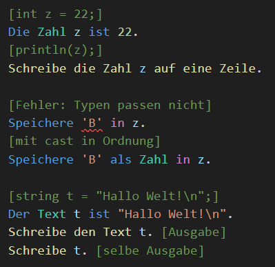
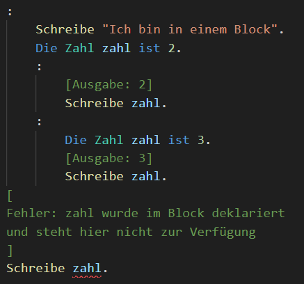
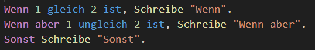
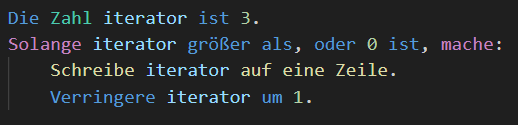
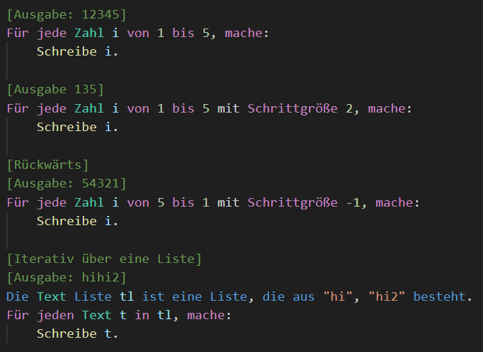
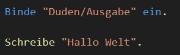
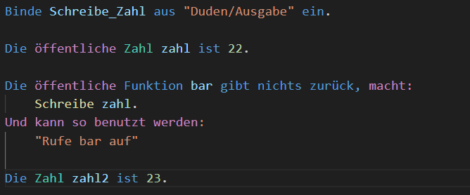
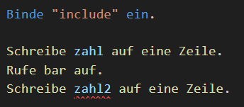

  
  <h6 align="right"> <a href="README.md">zum Deutschen README</a></h6>

<h1>Der <ins>K</ins>ompilierer <ins>D</ins>er <ins>D</ins>eutschen <ins>P</ins>rogrammiersprache (Compiler for the german programming language)</h1>

"Die Deutsche Programmiersprache" (DDP) is a (joke-)programming language by NotLe0n and bafto, which was designed so that programs written in it read like almost proper german.

The [Bedienungsanleitung](https://ddp.le0n.dev/Bedienungsanleitung/) (documentation) is a good starting point to get to know DDP; you can also find installation instructions there.

The [Playground](https://ddp.le0n.dev/Spieplatz) makes it possible to try out DDP without having to install the compiler.

If you want to work on the Compiler see [CONTRIBUTING-en](CONTRIBUTING-en.md)

## Installation

To install DDP, all you have to do is download the current release for the desired operating system from Github here,
Unpack the archive and run the installer (ddp-setup.exe).

Detailed installation instructions are available [here](https://ddp.le0n.dev/Bedienungsanleitung/EN/Einstieg).

## Feature overview

DDP is a statically typed, modular and imperative language.
Most of the features will be familiar to programmers.

### Expressions

Every expression in DDP produces a value of fixed type.

</img>

Variables also have a fixed type.

</img>

DDP also has Listen

</img>

### Instruction blocks

In DDP, multiple instructions can be grouped together in a block.

</img>

As you can see, each block begins with a ":".
Variables are transferred to sub-blocks, but
overshadow new declarations with the same name
old declarations.

Since {} are not symbols of German texts, the
Indentation depth (4 spaces or 1 tab) is used
to determine when a block is finished.

### If statements

For simple branches, DDP offers If statements.

</img>

Of course, this can also be done without instruction blocks, but only for single instructions.

</img>

### Loops

DDP supports most known loops.

While loops:

</img>

Do-While loops:

</img>

and most importantly, for loops:

</img>

So that you don't always have to write a long for loop
there are also repetitions:

</img>

Just like with if statements, this can all be done with single instructions.

</img>

### Functions

Functions are by far the most important feature of DDP, because they allow you to turn almost any German sentence or expression into code.

This is due to the way they are called, namely via so-called aliases.

</img>

As you can see, the function foo was called like a normal German expression without violating the grammatical rules.

Functions are a very big topic in DDP and this small example shows only a fraction of their complex syntax.

For more details, I strongly recommend reading [this article](https://ddp.le0n.dev/Bedienungsanleitung/EN/Programmierung/Funktionen) from the documentation thoroughly, or at least skimming the examples.

### Modules

In DDP, source code is organized into modules, where
a module is simply a source file.

In fact, all of the examples above already have used the Module
`"Duden/Ausgabe"` to be able to use the `Schreibe x` function.

</img>

When you include a module, only the functions/variables marked as 'public' become visible.

You can also just include the functions/variables that you need.

include.ddp:

</img>

main.ddp:

</img>
