

  
  <h6 align="right"> <a href="README-en.md"> go to english README</a></h6>

<h1>Der <ins>K</ins>ompilierer <ins>D</ins>er <ins>D</ins>eutschen <ins>P</ins>rogrammiersprache</h1>

Die Deutsche Programmiersprache (DDP) ist eine (Witz-)Programmiersprache von NotLe0n und bafto, die so entworfen wurde, dass in ihr geschriebene Programme so gelesen werden können wie (annähernd) korrektes Deutsch.

Die [Bedienungsanleitung](https://ddp-projekt.github.io/Bedienungsanleitung/?p=Startseite&lang=DE) ist ein guter Startpunkt um DDP (kennen) zu lernen, dort ist auch eine Installations-Anleitung zu finden.

Wer am Kompilierer mitarbeiten möchte, findet mehr dazu in [CONTRIBUTING](CONTRIBUTING.md).

## Installation

Um DDP zu installieren braucht man bloß den aktuellsten Release für das gewünschte Betriebssystem hier von Github zu Downloaden, 
das Archiv zu entpacken, und den Installer (ddp-setup.exe) auszuführen.

Eine detaillierte Installationsanleitung gibt es [hier](https://ddp-projekt.github.io/Bedienungsanleitung/?p=/Einstieg&lang=DE).

## Feature Übersicht

DDP ist eine statisch typisierte, modulare und imperative Sprache.
Die meisten Features werden Programmierern bekannt sein.

### Ausdrücke

Jeder Ausdruck in DDP produziert einen Wert mit festem Typ.

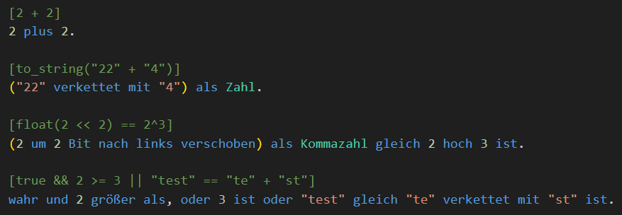

Variablen haben ebenfalls einen festen Typ.

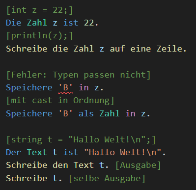

DDP hat auch Listen

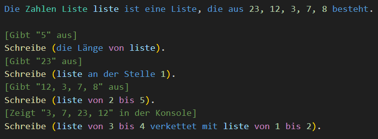

### Anweisungsblöcke

In DDP können mehrere Anweisungen in einem Block zusammengefasst werden.

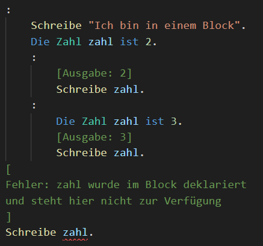

Wie man sieht beginnt jeder Block mit einem ":".
Variablen werden auf Unter-Blöcke übertragen, aber
neue Deklarationen mit dem selben Namen überschatten
alte Deklarationen.

Da {} keine Symbole von Deutschen Texten sind wird die
Einrückungstiefe (4 Leerzeichen oder 1 Tab) benutzt
um zu bestimmen wann ein Block fertig ist.

### If-Anweisungen

Für simple Verzweigungen bietet DDP Wenn Anweisungen.

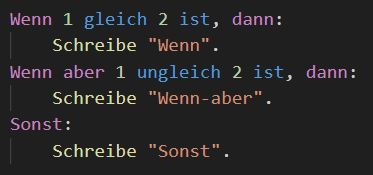

Das geht natürlich auch ohne Anweisungsblöcke, allerdings nur
für einzelne Anweisungen.

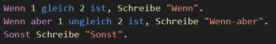

### Schleifen

DDP unterstützt die meisten bekannten Schleifen.

While-Schleifen:

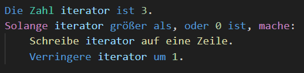

Do-While-Schleifen:

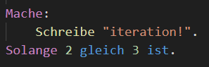

Und am wichtigsten, For-Schleifen:

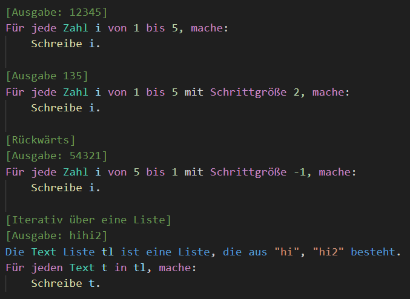

Damit man nicht immer eine lange For-Schleife schreiben muss
gibt es auch Wiederholungen:

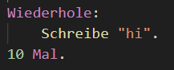

So wie bei If-Anweisungen geht das alles auch mit einzelnen
Anweisungen.

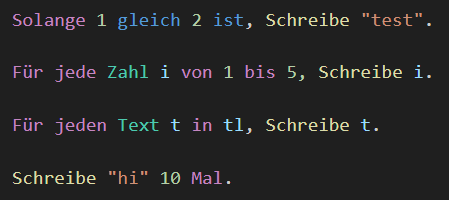

### Funktionen

Funktionen sind mit Abstand das wichtigste Feature von DDP,
denn sie erlauben es, so gut wie jeden deutschen Satz oder Ausdruck in Code zu verwandeln.

Das liegt an der Art wie man sie Aufruft, nämlich über so gennante Aliase.

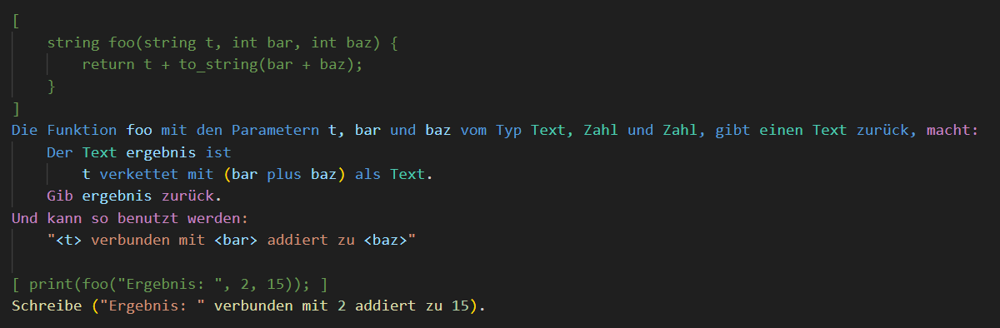

Wie man sie wurde die Funktion foo wie ein normaler deutscher Ausdruck aufgerufen, ohne die grammatikalischen Regeln zu verletzten.

Funktionen sind ein sehr großes Thema in DDP und dieses kleine Beispiel zeigt nur einen Bruchteil ihrer Komplexen Syntax.

Für mehr details empfehle ich dringen diesen [Artikel](https://ddp-projekt.github.io/Bedienungsanleitung/?p=Programmierung/Funktionen&lang=DE) aus der Bedienungsanleitung gründlich durchzulesen, oder zumindest die Beispiele zu überfliegen.

### Module

In DDP ist Quellcode in Modulen organisiert, wobei
ein Modul einfach eine Quelldatei ist.

Tatsächlich haben alle obigen Beispiele bereits das Module
`"Duden/Ausgabe"` benutzt, um die `Schreibe x` Funktion nutzen zu können.

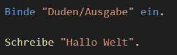

Wenn man ein Module einbindet, werden nur die als `öffentliche` markierten Funktionen/Variablen sichtbar.

Man kann auch bloß die Funktionen/Variablen einbinden, die man braucht.

include.ddp:

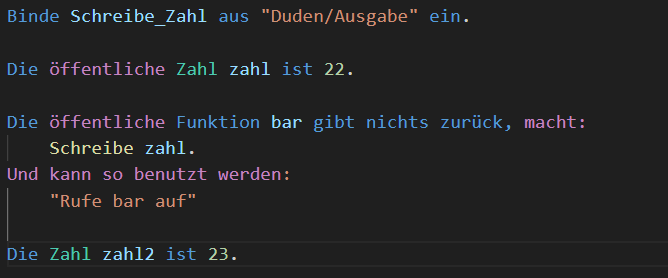

main.ddp:

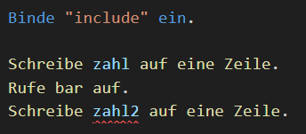